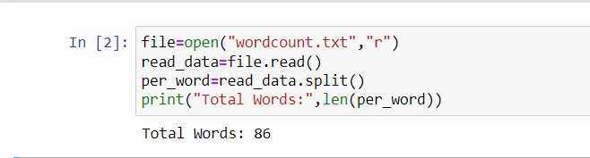
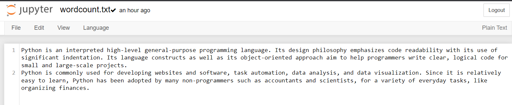

# Word-count
## AIM:
To write a python program for getting the word count from a text.
## EQUIPEMENT'S REQUIRED: 
PC
Anaconda - Python 3.7
## ALGORITHM: 
### Step 1:

Open a text file in read mode only.
Using file = open("wordcount.txt","r") we can open the file in a read-only mode and store this information in a file variable.
### Step 2: 

Using file = open("wordcount.txt","r") we can open the file in a read-only mode and store this information in a file variable.

### Step 3: 
read_data = file.read() this statement is used to read the entire data in one go and store it in a variable named read_data.

### Step 4:  

per_word = read_data.split() this statement is used to split the sentences into words using split().
per_word is the variable where the informations are stored.
### Step 5: 

To print the count of total words we use len().
len(per_words) gives the length of per_word variable .

### Step 6: 

Note that length is counting total words in the file.
## PROGRAM:
```
file=open("wordcount.txt","r")
read_data=file.read()
per_word=read_data.split()
print("Total Words:",len(per_word))
```
### OUTPUT:



### Text file:




## RESULT:
Thus the program is written to find the word count from a text.
